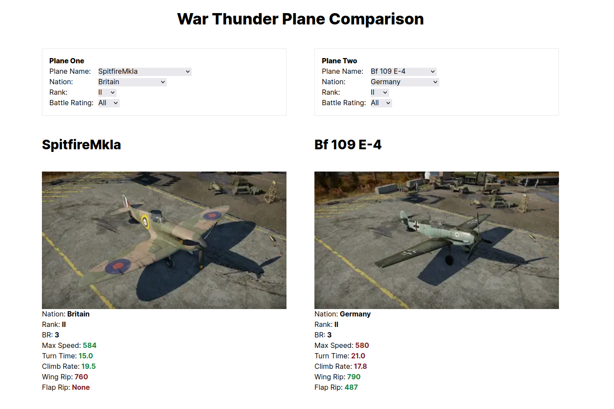

# Warthunder Plane Comparison



Note: there is a new wiki and the image urls are broken so I replaced with a placeholder. The scraper is likey also unusable now.

## Contents

- [Overview](#overview)
- [Frameworks](#frameworks)
- [Run project](#run-project)
- [Improvements](#improvements)
- [Useful links](#useful-links)

## Overview

Compare plane stats for the game Warthunder. Choose plane 1, choose plane 2, compare their stats. The best/worst stat will be highlighted.

I made this to quickly compare plane stats to see what advantage you might have over an opponent, eg. will their wings rip off in a high speed dive before yours will? Can you out turn them? Etc..

There are over 1000 planes so I added some filters to narrow the data.

NOTE: This repo includes a python script for scraping the plane data from the War Thunder wiki. It has its own README for details.

## Frameworks

- [NextJS](https://nextjs.org/docs)
- [TailwindCSS](https://tailwindcss.com/docs/installation)

## Run project

```sh
yarn # install dependencies
yarn dev # start nextjs dev server
```

## Improvements

- The style/design could be improved.
- Add a search box for finding a specific plane directly.

## Useful links

- [Tailwind cheat sheet](https://nerdcave.com/tailwind-cheat-sheet)
